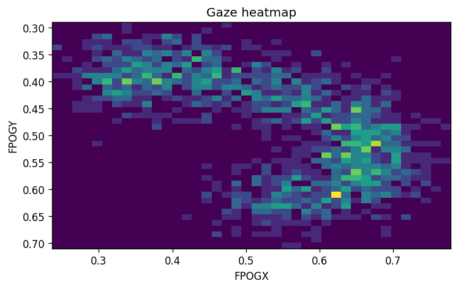
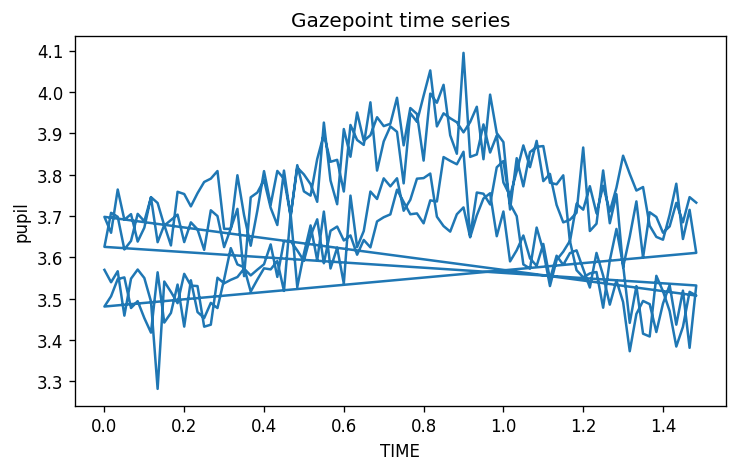
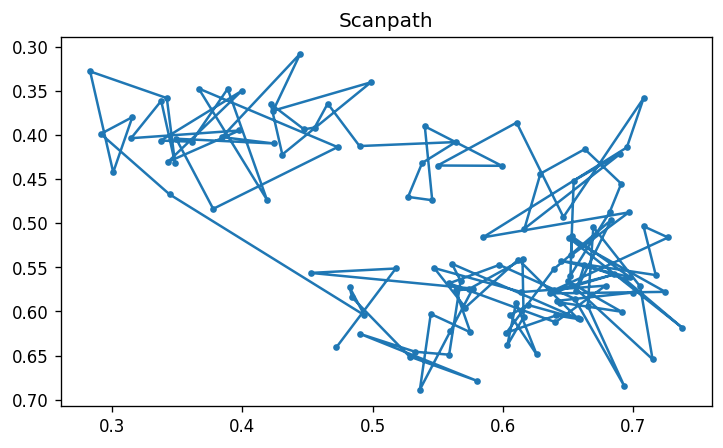
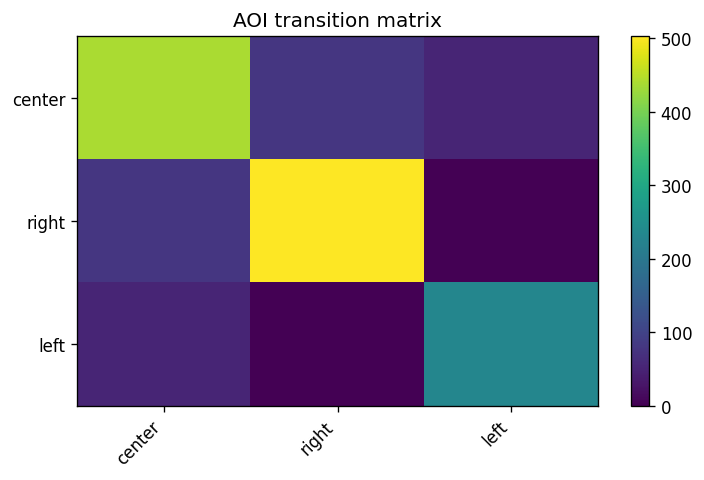
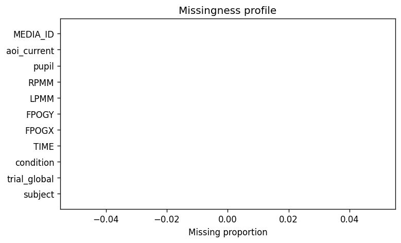
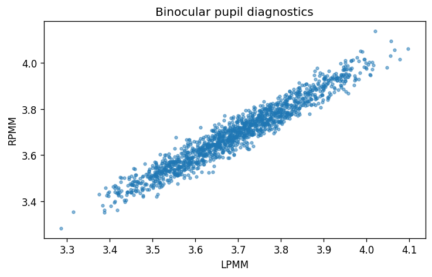

<div class="gp3-hero" markdown>

<div class="gp3-kicker">GAZEPOINT GP3 · EYE-TRACKING · PYTHON</div>

# gp3tools for Python

### From raw Gazepoint exports to auditable eye-tracking analysis.

`gp3tools` is a broad Python toolkit for **importing, validating,
preprocessing, visualising, modelling and reporting Gazepoint GP3 /
Gazepoint Analysis data**.

The Python implementation was validated against the frozen public API of
**gp3tools R 2.3.0**, while providing native Python workflows for gaze,
pupil, AOI, fixations, scanpaths, quality control, multimodal analysis,
statistics and research reporting.

[Get started](getting-started.md){ .md-button .md-button--primary }
[Browse the API](API_REFERENCE.md){ .md-button }
[Release v0.1.0a1](https://github.com/stefanosbalaskas/gp3tools-python/releases/tag/v0.1.0a1){ .md-button }

<div class="gp3-badges">

[](https://github.com/stefanosbalaskas/gp3tools-python/actions/workflows/ci.yml)
[](https://github.com/stefanosbalaskas/gp3tools-python/actions/workflows/docs.yml)
[](https://github.com/stefanosbalaskas/gp3tools-python/releases/tag/v0.1.0a1)


</div>
</div>

<div class="gp3-metrics">
  <div class="gp3-metric"><strong>278</strong><span>canonical R exports</span></div>
  <div class="gp3-metric"><strong>285</strong><span>Python public names</span></div>
  <div class="gp3-metric"><strong>684</strong><span>validated tests</span></div>
  <div class="gp3-metric"><strong>90.06%</strong><span>line coverage</span></div>
  <div class="gp3-metric"><strong>3.11–3.13</strong><span>CI-tested Python</span></div>
</div>

---

## Install the validated alpha

=== "pip"

    ```bash
    python -m pip install https://github.com/stefanosbalaskas/gp3tools-python/releases/download/v0.1.0a1/gp3tools-0.1.0a1-py3-none-any.whl
    ```

=== "uv"

    ```bash
    uv pip install https://github.com/stefanosbalaskas/gp3tools-python/releases/download/v0.1.0a1/gp3tools-0.1.0a1-py3-none-any.whl
    ```

Verify:

```python
import gp3tools as gp3

print(gp3.__version__)
print(len(gp3.R_EXPORTS))
# 278
```

[Installation and first workflow →](getting-started.md)

---

## What can gp3tools do?

<div class="grid cards" markdown>

- **Import & harmonise**

    Read Gazepoint exports, folders, fixation tables, summaries and external
    face-analysis data.

    [End-to-end workflow →](articles/end-to-end-workflow.md)

- **Quality control**

    Audit sampling rate, tracking quality, missingness, master-table integrity,
    screen bounds, coordinates, exclusions and model readiness.

    [QC workflows →](articles/qc-dashboard-workflow.md)

- **Pupil preprocessing**

    Detect artifacts and blinks, combine binocular channels, interpolate,
    baseline-correct, smooth, downsample and reconstruct pupil signals.

    [Pupil workflow →](articles/pupil-workflow.md)

- **AOI & transitions**

    Work with static, dynamic and polygon AOIs, entries, windows, transition
    matrices, entropy, sequences and network summaries.

    [AOI workflow →](articles/aoi-workflow.md)

- **Fixations & scanpaths**

    Analyse fixation/saccade events, scanpath geometry, clustering, stability,
    representative paths and detector agreement.

    [Scanpaths →](articles/fixation-transitions-scanpaths.md)

- **Models & inference**

    Prepare eye-tracking models, run time-course analysis, cluster permutation,
    sensitivity analysis and Bayesian bridge workflows.

    [Statistical workflows →](articles/statistical-extensions-plots.md)

- **Visualisation**

    Create heatmaps, pupil curves, missingness plots, scanpaths, transition
    matrices, cluster figures and binocular diagnostics.

    [Plot gallery →](articles/plot-gallery.md)

- **Interoperability**

    Prepare outputs for BIDS, HDDM, eyetrackingR-style, pupillometryR-style,
    gazer, eyetools and gpbiometrics workflows.

    [Ecosystem exports →](articles/ecosystem-exports.md)

</div>

---

## A workflow in a few lines

```python
import gp3tools as gp3

master = gp3.load_example_master()

sampling = gp3.check_sampling_rate(
    master,
    time_col="TIME",
    group_cols=["subject", "trial_global"],
)

processed = gp3.preprocess_gazepoint_signals(
    master,
    pupil_col="pupil",
    time_col="TIME",
)

transitions = gp3.compute_gazepoint_aoi_transition_matrix(
    master,
    aoi_col="aoi_current",
)

fig = gp3.plot_gazepoint_heatmap(master)
```

The bundled datasets are synthetic, so core workflows can be reproduced
without private participant data.

[Complete Python workflow →](articles/complete-python-workflow.md)

---

## See the data, not just the API

<div class="gp3-gallery">

<figure><figcaption>Spatial gaze heatmap</figcaption></figure>
<figure><figcaption>Pupil time course</figcaption></figure>
<figure><figcaption>Fixation scanpath</figcaption></figure>
<figure><figcaption>AOI transition matrix</figcaption></figure>
<figure><figcaption>Missingness profile</figcaption></figure>
<figure><figcaption>Binocular pupil diagnostic</figcaption></figure>

</div>

[Open the full plot gallery →](articles/plot-gallery.md)

---

## Validation at a glance

!!! success "Validated release surface"

    **v0.1.0a1** freezes **278 canonical R exports** and exposes **285 Python
    public names**, with **684 passing tests**, **90.06% line coverage**,
    R1–R4 behavioral and semantic validation, strict documentation builds,
    runnable examples, distribution builds and wheel-installation validation.

!!! info "Scientific backend transparency"

    Functions whose original R implementation depended on engines such as
    `lme4`, `glmmTMB`, `mgcv` or `brms` are documented as Python-native
    adaptations rather than falsely presented as coefficient-identical
    implementations.

[Read the parity and validation status →](PARITY_STATUS.md)

---

## Citation

> Balaskas, S. (2026). *gp3tools: An R Package for Reproducible Analysis and
> Reporting of Gazepoint GP3 Eye-Tracking Exports*. **Journal of Eye Movement
> Research, 19**(4), 76.
> [https://doi.org/10.3390/jemr19040076](https://doi.org/10.3390/jemr19040076)

[GitHub](https://github.com/stefanosbalaskas/gp3tools-python){ .md-button .md-button--primary }
[Release](https://github.com/stefanosbalaskas/gp3tools-python/releases/tag/v0.1.0a1){ .md-button }
[R implementation](https://github.com/stefanosbalaskas/gp3tools){ .md-button }
